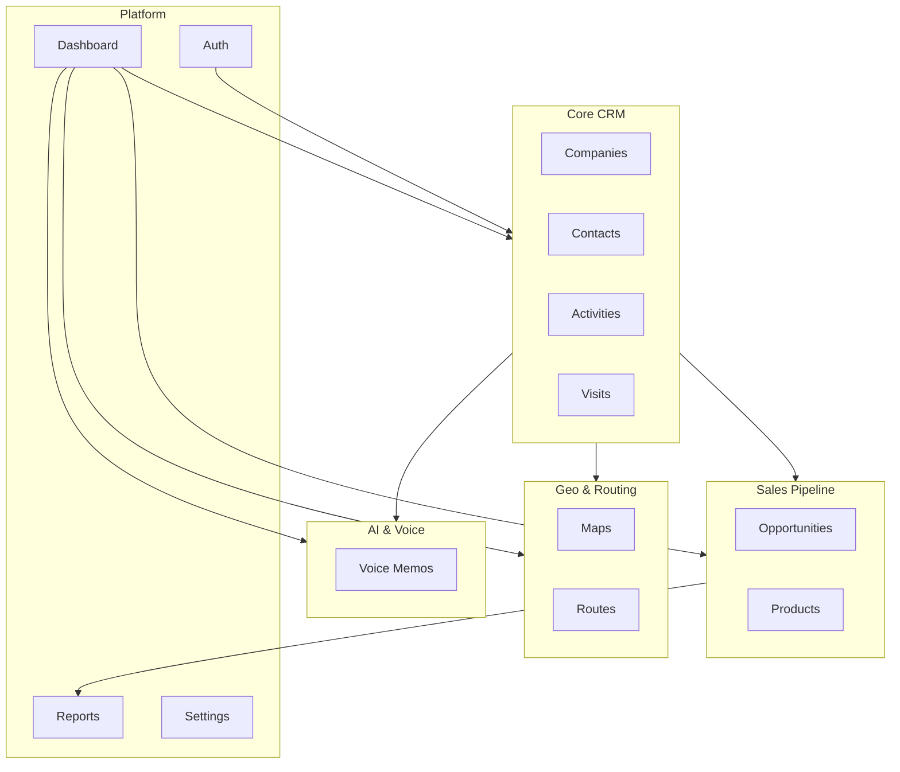

# Eterya CRM — Master Plan

> Documento di riferimento architetturale e operativo per lo sviluppo del CRM enterprise.

---

## 1. Visione del prodotto

**Eterya CRM** è una piattaforma CRM enterprise orientata al **field sales**: agenti commerciali che gestiscono oltre 100.000 aziende, pianificano visite, ottimizzano percorsi geografici, registrano attività con promemoria vocali e AI, e chiudono il ciclo commerciale (preventivi → ordini).

### Obiettivi strategici

| Obiettivo | Descrizione |
|---|---|
| **Scalabilità** | Gestione di 100.000+ aziende per tenant con performance sub-secondo |
| **Mobilità** | PWA offline-first per agenti in campo |
| **Geo-native** | Mappe, geolocalizzazione e percorsi intelligenti al centro |
| **AI-first** | Trascrizione vocale e estrazione automatica di action item |
| **Multi-tenant** | Isolamento dati per organizzazione con RBAC granulare |
| **Modularità** | Architettura feature-based pronta per crescita incrementale |

### Utenti target

- **Field Agent** — visite, attività, promemoria vocali, percorsi
- **Sales Manager** — dashboard team, assegnazione territori, approvazioni
- **Org Admin** — configurazione, utenti, catalogo prodotti
- **Executive** — KPI, pipeline, report strategici

---

## 2. Moduli



| Modulo | Path feature | Responsabilità |
|---|---|---|
| **Dashboard** | `features/dashboard` | Home, KPI, widget riassuntivi |
| **Companies** | `features/companies` | CRUD aziende, geocoding, ricerca |
| **Contacts** | `features/contacts` | Referenti per azienda |
| **Activities** | `features/activities` | Task, chiamate, note, follow-up |
| **Visits** | `features/visits` | Visite pianificate ed eseguite |
| **Maps** | `features/maps` | Visualizzazione mappa, clustering |
| **Routes** | `features/routes` | Ottimizzazione percorsi TSP/VRP |
| **Voice** | `features/voice` | Registrazione, trascrizione AI |
| **Opportunities** | `features/opportunities` | Preventivi e pipeline commerciale |
| **Products** | `features/products` | Catalogo prodotti e listini |
| **Reports** | `features/reports` | Analytics, export, KPI avanzati |
| **Auth** | `features/auth` | Login, registrazione, RBAC |
| **Settings** | `features/settings` | Configurazione org e profilo |

---

## 3. Architettura

### 3.1 High-level

```
┌─────────────────────────────────────────────────────────┐
│                    PWA Client (Next.js 16)               │
│  React 19 · RSC · Server Actions · Service Worker      │
├─────────────────────────────────────────────────────────┤
│  features/          Bounded context per modulo           │
│  components/ui/     Design system condiviso              │
│  lib/               Client Supabase, utils, constants    │
│  services/          Layer dati (mock → Supabase)         │
│  types/             Contratti TypeScript + Zod           │
├─────────────────────────────────────────────────────────┤
│                    Supabase Backend                      │
│  Auth · PostgreSQL+PostGIS · Storage · Realtime · Edge │
├─────────────────────────────────────────────────────────┤
│                    Servizi esterni                       │
│  OpenAI · OSRM · MapTiler · Web Push                    │
└─────────────────────────────────────────────────────────┘
```

### 3.2 Pattern per feature

Ogni feature segue la struttura:

```
features/{module}/
├── components/     # UI specifica del modulo
├── hooks/          # Hook React del modulo
├── services/       # Chiamate dati (mock o Supabase)
├── types/          # Tipi locali (se non condivisi)
└── index.ts        # Public API del modulo
```

### 3.3 Data flow

1. **Server Components** — fetch dati via `services/` (futuro: Supabase server client)
2. **Client Components** — interattività, form, mappe, registrazione vocale
3. **Server Actions** — mutazioni con validazione Zod
4. **Offline queue** — IndexedDB per sync differito (fase PWA)

---

## 4. Stack tecnologico

| Layer | Tecnologia | Versione |
|---|---|---|
| Framework | Next.js (App Router) | 16.x |
| UI | React | 19.x |
| Linguaggio | TypeScript | 5.x |
| Styling | Tailwind CSS | 4.x |
| Icone | Lucide React | latest |
| Backend | Supabase | — |
| Database | PostgreSQL + PostGIS | — |
| AI | OpenAI (Whisper + GPT) | — |
| Mappe | MapLibre GL JS | fase 2 |
| Routing | OSRM | fase 2 |
| PWA | Serwist | fase 2 |
| Validazione | Zod | fase 2 |
| State | TanStack Query + Zustand | fase 2 |

---

## 5. Regole di sviluppo

### 5.1 Convenzioni codice

- **Naming**: PascalCase componenti, camelCase funzioni/variabili, kebab-case file route
- **Import alias**: `@/` mappa alla root del progetto
- **Export**: ogni feature espone solo ciò che serve via `index.ts`
- **Tipi**: condivisi in `types/`, specifici del modulo in `features/{module}/types/`
- **Mock data**: in `lib/mock-data/`, mai mescolati con componenti
- **Servizi**: interfaccia unica in `services/`, implementazione mock o Supabase

### 5.2 Componenti

- Server Component di default; `"use client"` solo quando necessario
- Props tipizzate con interface/type espliciti
- UI primitivi in `components/ui/`, composizioni in `features/*/components/`
- Nessuna logica business nei componenti UI puri

### 5.3 Git e qualità

- Branch: `feature/{module}-{descrizione}`, `fix/{descrizione}`
- Commit: conventional commits (`feat:`, `fix:`, `docs:`, `refactor:`)
- Pre-merge: `npm run build` + `npm run lint` devono passare
- No secrets in repo; env in `.env.local`

### 5.4 Supabase readiness

- Tutti i servizi dati passano da `services/` con interfaccia tipizzata
- Tipi DB generati in `types/database.ts` (futuro: `supabase gen types`)
- RLS policies documentate in `supabase/migrations/`
- Client Supabase: `lib/supabase/client.ts` (browser) e `server.ts` (RSC)

---

## 6. Struttura database

### 6.1 Estensioni PostgreSQL

```sql
CREATE EXTENSION IF NOT EXISTS postgis;
CREATE EXTENSION IF NOT EXISTS pg_trgm;
CREATE EXTENSION IF NOT EXISTS btree_gist;
```

### 6.2 Tabelle core

| Tabella | Descrizione | Indici chiave |
|---|---|---|
| `organizations` | Tenant | PK `id` |
| `users` | Utenti (via Supabase Auth) | `org_id`, `role` |
| `companies` | Aziende | GIST `location`, GIN `search_vector`, `org_id` |
| `contacts` | Referenti | `company_id`, `org_id` |
| `activities` | Attività/task | `user_id`, `due_at`, `status`, `org_id` |
| `visits` | Visite | `company_id`, `user_id`, `scheduled_at`, `org_id` |
| `routes` | Percorsi | `user_id`, `route_date`, `org_id` |
| `route_stops` | Tappe percorso | `route_id`, `sequence` |
| `voice_memos` | Promemoria vocali | `activity_id`, `status`, `org_id` |
| `products` | Catalogo | `org_id`, `category_id` |
| `opportunities` | Preventivi/pipeline | `company_id`, `status`, `org_id` |
| `opportunity_lines` | Righe preventivo | `opportunity_id` |
| `attachments` | File/foto | `entity_type`, `entity_id`, `org_id` |
| `audit_logs` | Audit trail | `org_id`, `created_at` |
| `territories` | Zone geografiche | GIST `boundary`, `org_id` |

### 6.3 Modello companies (esempio)

```sql
CREATE TABLE companies (
  id            UUID PRIMARY KEY DEFAULT gen_random_uuid(),
  org_id        UUID NOT NULL REFERENCES organizations(id),
  name          TEXT NOT NULL,
  vat_number    TEXT,
  location      GEOGRAPHY(POINT, 4326),
  address       TEXT,
  city          TEXT,
  province      TEXT,
  postal_code   TEXT,
  country       TEXT DEFAULT 'IT',
  status        TEXT DEFAULT 'active',
  assigned_user_id UUID REFERENCES users(id),
  metadata      JSONB DEFAULT '{}',
  search_vector TSVECTOR,
  created_at    TIMESTAMPTZ DEFAULT now(),
  updated_at    TIMESTAMPTZ DEFAULT now()
);

CREATE INDEX idx_companies_org_location ON companies USING GIST (org_id, location);
CREATE INDEX idx_companies_search ON companies USING GIN (search_vector);
```

### 6.4 RLS

Ogni tabella con `org_id` ha policy:
- Isolamento tenant: `org_id = auth.jwt()->>'org_id'`
- Scope agente: solo record assegnati o ruolo manager/admin

---

## 7. Roadmap

### Fase 1 — Foundation (settimane 1–6) ✅ in corso

- [x] Struttura progetto e master plan
- [x] Dashboard con dati mock
- [ ] Setup Supabase + schema DB
- [ ] Auth multi-tenant + RBAC
- [ ] CRUD Companies + geocoding
- [ ] Layout app completo + navigazione

### Fase 2 — Field Operations (settimane 7–12)

- [ ] Agenda + Visite + Attività
- [ ] Mappa aziende (MapLibre)
- [ ] Percorso intelligente (OSRM)
- [ ] Promemoria vocali + upload
- [ ] Allegati e foto

### Fase 3 — Sales (settimane 13–18)

- [ ] Catalogo prodotti
- [ ] Opportunities / preventivi + PDF
- [ ] Pipeline commerciale

### Fase 4 — Intelligence (settimane 19–24)

- [ ] Dashboard KPI real-time
- [ ] Reports avanzati + export
- [ ] AI trascrizione + estrazione entità
- [ ] PWA offline completa
- [ ] Push notifications

---

## 8. Sicurezza

| Area | Implementazione |
|---|---|
| Autenticazione | Supabase Auth + MFA |
| Autorizzazione | RLS PostgreSQL + RBAC middleware |
| Validazione input | Zod su ogni endpoint e form |
| File upload | MIME check, size limit, quota org |
| Rate limiting | Upstash Redis (fase 2) |
| Audit | Tabella `audit_logs` immutabile |
| GDPR | Soft delete, export dati, retention 90gg audio |
| Headers | CSP, HSTS, X-Frame-Options via middleware |
| Secrets | Solo env vars, mai in codice |

---

## 9. Geolocalizzazione

### Stack

- **PostGIS** — query spaziali native (`ST_DWithin`, `ST_Contains`, clustering)
- **MapLibre GL JS** — rendering mappe vector tiles
- **MapTiler / Protomaps** — tile provider
- **OSRM** — routing e ottimizzazione TSP

### Funzionalità

1. Geocoding address → coordinate (import + form)
2. Mappa aziende con clustering per zoom level
3. Heatmap copertura territoriale
4. Filtro per raggio / territorio assegnato
5. Check-in visita con coordinate GPS
6. Ottimizzazione percorso giornaliero

### Query chiave

```sql
-- Aziende nel raggio di 50km
SELECT * FROM companies
WHERE org_id = $1
  AND ST_DWithin(location, ST_MakePoint($lng, $lat)::geography, 50000);

-- Clustering per mappa
SELECT ST_ClusterKMeans(location::geometry, 20) OVER () AS cluster, *
FROM companies WHERE org_id = $1;
```

---

## 10. Gestione vocali AI

### Pipeline

```
Registrazione (MediaRecorder)
  → Upload Supabase Storage
  → Edge Function trigger
  → OpenAI Whisper (trascrizione)
  → GPT-4o-mini (estrazione entità + action items)
  → Salvataggio activity + metadata
  → Notifica agente/manager
```

### Output strutturato

```json
{
  "summary": "Visita positiva, interesse prodotto X",
  "sentiment": "positive",
  "action_items": [
    { "type": "follow_up_call", "due_in_days": 3 }
  ],
  "entities": {
    "contact_name": "Mario Rossi",
    "budget_mentioned": "€15.000"
  }
}
```

### Cost control

- Quota mensile per org
- GPT-4o-mini per estrazione (non GPT-4)
- Cache trascrizioni per evitare ri-processamento

---

## 11. Importazione Excel

### Flusso

1. Upload file `.xlsx` / `.csv`
2. Parsing client-side (SheetJS) o server-side (Edge Function)
3. Mapping colonne → campi DB (UI configurabile)
4. Validazione batch (Zod)
5. Geocoding asincrono per righe con indirizzo
6. Preview + conferma
7. Insert batch con progress bar
8. Report errori/righe scartate

### Colonne standard

| Colonna Excel | Campo DB |
|---|---|
| Ragione Sociale | `companies.name` |
| P.IVA | `companies.vat_number` |
| Indirizzo | `companies.address` |
| Città | `companies.city` |
| CAP | `companies.postal_code` |
| Provincia | `companies.province` |
| Referente | `contacts.full_name` |
| Email | `contacts.email` |
| Telefono | `contacts.phone` |

### Performance

- Batch insert 500 righe per transazione
- Geocoding in coda (Inngest/Edge Function)
- Duplicati: match su `vat_number` o fuzzy `name + city`

---

## 12. PWA

### Requisiti offline

| Feature | Offline | Sync |
|---|---|---|
| Lista aziende assegnate | ✅ | — |
| Agenda del giorno | ✅ | — |
| Crea visita/attività | ✅ | Background Sync |
| Promemoria vocale | ✅ | Background Sync |
| Foto visita | ✅ | Background Sync |
| Dashboard KPI | ❌ | — |

### Implementazione (fase 2)

- `app/manifest.ts` — manifest PWA
- `@serwist/next` — service worker
- Dexie.js — coda offline IndexedDB
- Web Push — notifiche promemoria

---

## 13. Multiutente

### Modello RBAC

| Ruolo | Permessi |
|---|---|
| Super Admin | Gestione tenant, billing |
| Org Admin | Config org, utenti, prodotti |
| Manager | Team, territori, approvazioni |
| Agent | Aziende assegnate, visite, attività |
| Viewer | Solo lettura report |

### Multi-tenancy

- **Shared database + RLS** per isolamento tenant
- JWT claims: `org_id`, `role`, `team_id`, `territory_ids[]`
- Invite flow via email
- SSO SAML/OIDC (fase 3)

---

## 14. Struttura cartelle progetto

```
eterya-crm/
├── app/
│   ├── (dashboard)/
│   │   ├── layout.tsx
│   │   └── page.tsx
│   ├── layout.tsx
│   └── globals.css
├── components/
│   ├── ui/
│   └── layout/
├── features/
│   ├── dashboard/
│   ├── companies/
│   ├── contacts/
│   ├── activities/
│   ├── visits/
│   ├── maps/
│   ├── routes/
│   ├── voice/
│   ├── opportunities/
│   ├── products/
│   ├── reports/
│   ├── auth/
│   └── settings/
├── lib/
│   ├── mock-data/
│   └── constants/
├── services/
├── types/
├── hooks/
├── utils/
├── supabase/          (fase 2)
│   ├── migrations/
│   └── functions/
└── CRM_MASTER_PLAN.md
```

---

*Ultimo aggiornamento: Luglio 2026 — Eterya CRM v0.1*
